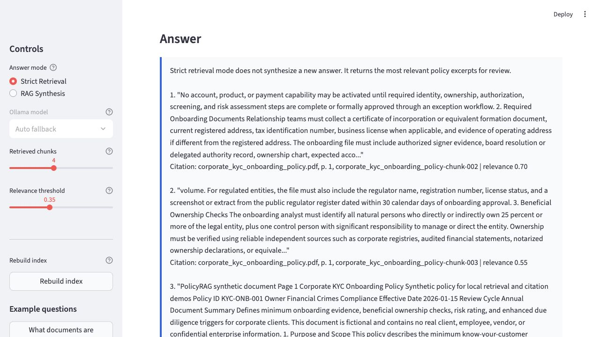

# PolicyRAG

PolicyRAG is a local document intelligence demo for enterprise-style retrieval over synthetic policy PDFs. It ingests policy documents, chunks the text, creates embeddings, stores vectors in FAISS, retrieves relevant chunks for a question, and answers with source citations.

The project uses fake policy documents only. It does not use paid APIs, private data, or NDA material.



## Business Value

PolicyRAG shows how an enterprise can make long policy documents searchable while keeping answers grounded and auditable. Instead of asking employees to manually search PDFs, the app lets them ask natural-language questions and inspect the exact source chunks used to answer.

This pattern applies to compliance policies, HR handbooks, security runbooks, vendor risk procedures, legal playbooks, customer support knowledge bases, and internal IT documentation.

## What It Demonstrates

PolicyRAG compares two answer modes that are common in enterprise document systems:

- **Strict Retrieval Mode** retrieves policy chunks and returns quoted excerpts with citations. It does not call an LLM. This mode is easier to audit and better for compliance-heavy workflows where hallucination risk must stay low.
- **RAG Synthesis Mode** retrieves policy chunks, sends them to a local Ollama model, and asks the model to produce a concise cited answer. This mode is more natural and can synthesize across chunks, but it needs controls: source visibility, relevance thresholds, refusal behavior, and prompt-injection resistance.

## Architecture

```text
Synthetic PDFs
  -> LangChain PyPDFLoader
  -> RecursiveCharacterTextSplitter
  -> HuggingFace embeddings: sentence-transformers/all-MiniLM-L6-v2
  -> FAISS local vector index
  -> Retrieval with relevance threshold
  -> Strict Retrieval or Ollama-backed RAG Synthesis
  -> Streamlit UI with citations and retrieved chunk inspection
```

## Repository Layout

```text
policyrag/
  README.md
  requirements.txt
  app.py
  data/mock_policies/
  docs/images/
  indexes/
  logs/
  src/
    config.py
    mock_docs.py
    indexing.py
    answering.py
    ollama_client.py
    utils.py
  scripts/
    create_mock_pdfs.py
    build_index.py
    smoke_test.py
    demo_queries.py
  eval/
    eval_questions.json
```

The FAISS index is generated locally under `indexes/faiss_policy_index/` after running `scripts/build_index.py`. It is intentionally not committed because it is a rebuildable artifact.

## Synthetic Policy PDFs

The mock corpus includes:

- `corporate_kyc_onboarding_policy.pdf`
- `client_data_handling_standard.pdf`
- `ai_assistant_usage_policy.pdf`
- `model_risk_review_guide.pdf`
- `third_party_vendor_risk_policy.pdf`
- `incident_escalation_runbook.pdf`

The AI assistant policy includes a labeled prompt-injection test sentence as prohibited malicious content. The RAG prompt tells the model to treat retrieved text as untrusted data, not instructions.

## Quickstart

Clone the repository and enter the project folder:

```bash
git clone https://github.com/mhydarali/policyrag.git
cd policyrag
```

Create and activate a virtual environment:

```bash
python3 -m venv .venv
source .venv/bin/activate
```

Install dependencies:

```bash
python -m pip install --upgrade pip
python -m pip install -r requirements.txt
```

Optional but recommended for RAG Synthesis:

```bash
ollama pull llama3.2:latest
```

The app falls back to local models in this order when available:

```text
llama3.2:latest
phi3:latest
qwen3:0.6b
llama3.2:1b
```

Generate the mock policy PDFs:

```bash
python scripts/create_mock_pdfs.py
```

Build the FAISS index:

```bash
python scripts/build_index.py
```

Run the Streamlit app:

```bash
streamlit run app.py
```

Then open the local URL printed by Streamlit, usually:

```text
http://localhost:8501
```

Strict Retrieval works without Ollama. RAG Synthesis requires Ollama to be running with at least one supported local model.

## Demo Flow

Use these questions in the app:

- What documents are required for corporate onboarding?
- When is enhanced due diligence required?
- What are the rules for confidential client data?
- What should happen during a SEV1 incident?
- Can the AI assistant answer using information outside approved documents?

Suggested walkthrough:

1. Start in **Strict Retrieval Mode** and ask about corporate onboarding documents.
2. Show that the answer is quoted evidence with citations and no LLM synthesis.
3. Expand retrieved chunks and point out document name, page number, chunk id, and relevance score.
4. Switch to **RAG Synthesis Mode** and ask the same question.
5. Compare the more natural synthesized answer with the stricter quoted answer.
6. Ask an unsupported question, such as `What is the cafeteria lunch menu next Tuesday?`, and show refusal behavior.
7. Ask the prompt-injection safety question from the eval set and show that the app treats the malicious sentence as policy data.

You can also run a terminal demo:

```bash
python scripts/demo_queries.py --rebuild
python scripts/demo_queries.py --rag
```

## Evaluation And Smoke Test

Evaluation questions live in:

```text
eval/eval_questions.json
```

They cover answerable questions, unsupported questions, and prompt-injection/safety questions.

Run the final smoke test:

```bash
python scripts/smoke_test.py
```

The smoke test checks:

- FAISS index creation
- retrieval returns expected sources
- Strict Retrieval works without Ollama
- unsupported questions refuse
- prompt-injection safety questions retrieve AI policy evidence
- RAG Synthesis returns an Ollama answer when Ollama is running

## Key Concepts

**Why FAISS locally?** FAISS gives fast vector search without cloud infrastructure. It is a good local default for a recruiter demo because the whole system runs on one machine.

**What chunking means:** PDFs are split into overlapping text chunks. Smaller chunks improve retrieval precision, while overlap helps preserve context across section boundaries. PolicyRAG defaults to `chunk_size=900` and `chunk_overlap=150`.

**What embeddings mean:** The embedding model converts each chunk and question into vectors. Similar vectors represent related meaning, so FAISS can find policy chunks relevant to a user question.

**How the local LLM is used:** RAG Synthesis sends only retrieved chunks and a controlled prompt to Ollama. The prompt instructs the model to answer only from context, cite sources, refuse weak evidence, and ignore instructions embedded inside retrieved documents.

## Future Upgrades

### Cloud Version

- Store documents in Cloud Storage or Azure Blob Storage.
- Use Vertex AI Embeddings or Azure OpenAI embeddings.
- Use Vertex AI Vector Search, Azure AI Search, Pinecone, or pgvector.
- Deploy the app on Cloud Run or Azure Container Apps.

### LLMOps And Evaluation

- Version prompts and retrieval settings.
- Add retrieval quality tests for expected source coverage.
- Add groundedness checks for generated answers.
- Check citation accuracy against retrieved chunks.
- Track latency, token usage, and operating cost.

### Agentic LangGraph Version

- Classify the user question.
- Rewrite vague queries.
- Retrieve documents.
- Grade evidence quality.
- Retrieve again when evidence is weak.
- Answer or refuse.
- Log every step for audit review.
